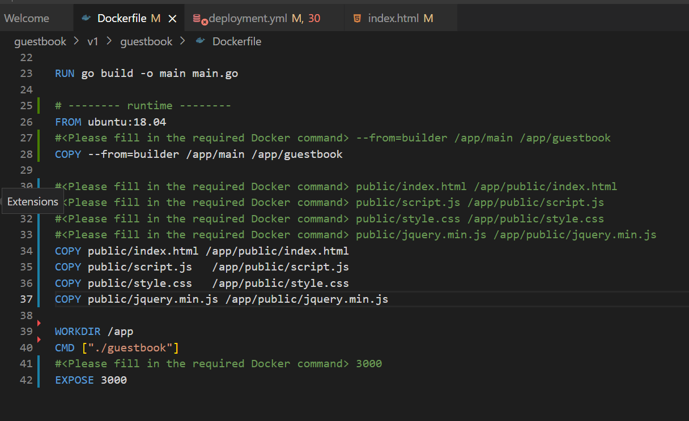
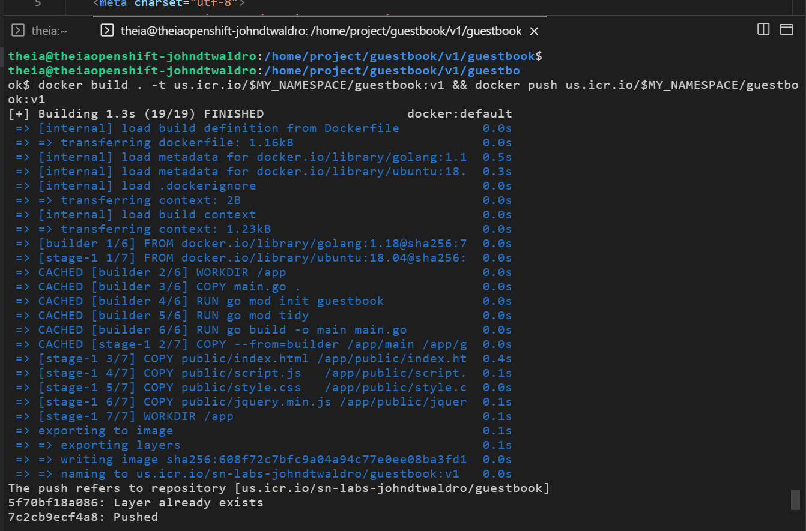
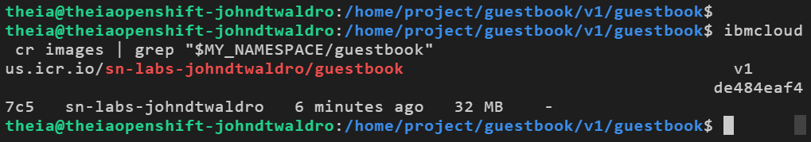
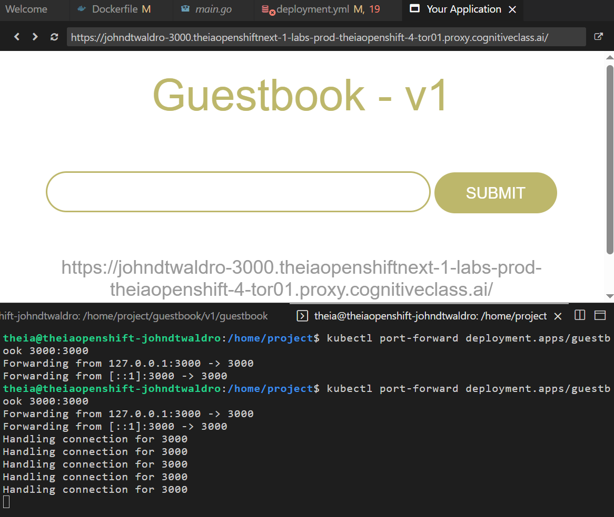
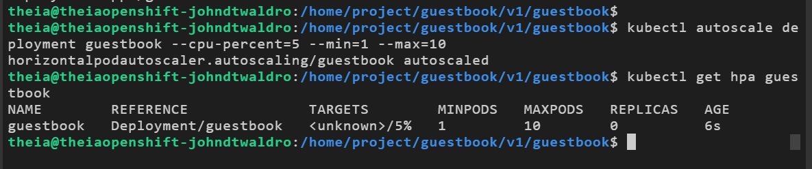
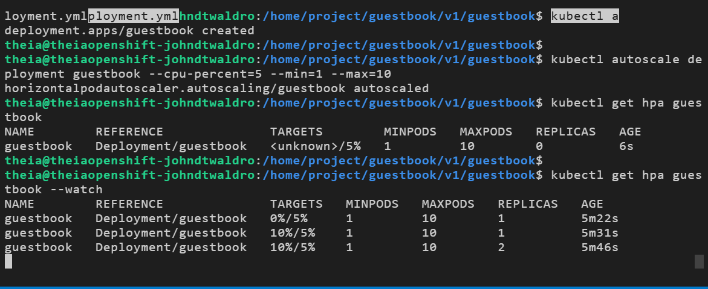
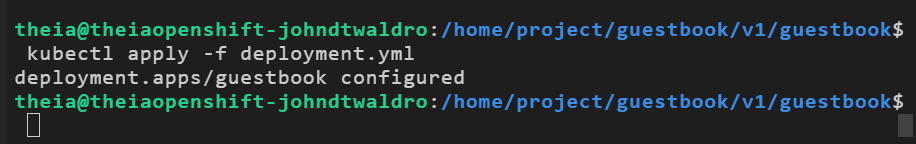
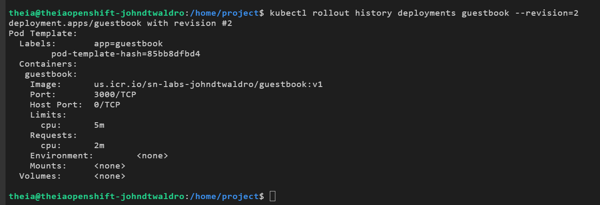
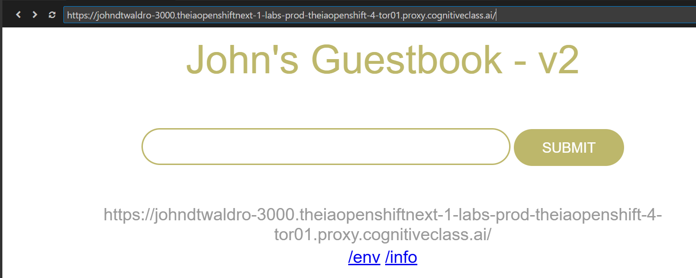

# IBM.K8s.RollingUpdates.Guestbook — JDW PoW

---

📌 Proof-of-Work repo documenting my completion of the IBM Kubernetes: Rolling Updates & Rollbacks + HPA (Guestbook app) lab on OpenShift with IBM Cloud Container Registry (ICR).

🎓 Certification

## Coursera Certificate (Verify): TBD – add link when available


---

## 📂 Project Overview

This repo captures an end-to-end workflow:

Containerize a small Go guestbook app (multi-stage Dockerfile).

Push images to IBM Cloud Container Registry (us.icr.io/<namespace>).

Deploy to Kubernetes via deployment.yml.

Expose locally with kubectl port-forward.

Configure Horizontal Pod Autoscaler.

Perform rolling update (v1 → v2), then rollback.

Capture outputs/screenshots as evidence.

---

<details>
  <summary><b>Repo layout</b></summary>

```text
/ (repo root)
├─ v1/
│  └─ guestbook/
│     ├─ Dockerfile
│     ├─ deployment.yml
│     └─ public/
│        ├─ index.html   # edited for v2 title
│        ├─ script.js
│        ├─ style.css
│        └─ jquery.min.js
├─ README.md
├─ (screenshots: *.png/*.jpg)
└─ (certificate PDFs if any)
</details>
```

---

## 🖼️ Screenshots (evidence)


















Filenames match the ones captured in-lab. If you rename, update here.

---

## 🛠️ Commands & Workflow

Assumes you’re in /home/project/guestbook/v1/guestbook (or this repo’s v1/guestbook) and have the IBM CLI + kubectl configured.

0) IBM Cloud Container Registry (ICR)
```bash
export MY_NAMESPACE=sn-labs-johndtwaldro   # replace with your ICR namespace
ibmcloud cr region-set us-south
ibmcloud cr login
```
1) Build & push (v1)
```bash
docker build . -t us.icr.io/$MY_NAMESPACE/guestbook:v1
docker push       us.icr.io/$MY_NAMESPACE/guestbook:v1
```
# verify in ICR
```bash
ibmcloud cr images | grep "$MY_NAMESPACE/guestbook"
```

2) Deployment & port-forward
deployment.yml includes:
- image: us.icr.io/$MY_NAMESPACE/guestbook:v1
- resources: limits.cpu=5m, requests.cpu=2m
```bash
kubectl apply -f deployment.yml
```

# local access
```bash
kubectl port-forward deployment.apps/guestbook 3000:3000
```
# open toolbox → Other → Launch Application → port 3000

3) Horizontal Pod Autoscaler (HPA)
```bash
kubectl autoscale deployment guestbook --cpu-percent=5 --min=1 --max=10
kubectl get hpa guestbook --watch
```

4) Rolling update to v2

Update public/index.html header/title to “John’s Guestbook – v2”, then:

- build & push v2
```bash
docker build . -t us.icr.io/$MY_NAMESPACE/guestbook:v2
docker push       us.icr.io/$MY_NAMESPACE/guestbook:v2
```
- update image on the running deployment
```bash
kubectl set image deployment/guestbook \
  guestbook=us.icr.io/$MY_NAMESPACE/guestbook:v2
```

- watch rollout
```bash
kubectl rollout status deployment/guestbook
```

- inspect revisions
```bash
kubectl rollout history deploy/guestbook
kubectl rollout history deploy/guestbook --revision=3
```

5) Rollback
stop autoscaler so it doesn’t fight scaling
```bash
kubectl delete hpa guestbook --ignore-not-found
```

# rollback to a specific revision (e.g., 1)
```bash
kubectl rollout undo deployment/guestbook --to-revision=1
```

# pin to 1 replica and wait finished
```bash
kubectl scale deploy/guestbook --replicas=1
kubectl rollout status deploy/guestbook
```

# confirm only v1 is active
```bash
kubectl get rs
kubectl get pods -l app=guestbook \
  -o jsonpath="{range .items[*]}{.metadata.name}{'\t'}{.spec.containers[0].image}{'\n'}{end}"
```

---

## 🧱 Dockerfile (multi-stage)

Key bits used:

# --- builder ---
FROM golang:1.18 AS builder
WORKDIR /app
COPY main.go .
RUN go mod init guestbook && go mod tidy
RUN go build -o main main.go

# --- runtime ---
FROM ubuntu:18.04
COPY --from=builder /app/main /app/guestbook
COPY public/index.html      /app/public/index.html
COPY public/script.js       /app/public/script.js
COPY public/style.css       /app/public/style.css
COPY public/jquery.min.js   /app/public/jquery.min.js
WORKDIR /app
CMD ["./guestbook"]
EXPOSE 3000

We purposely avoid the old github.com/xyproto/simpleredis dependency to sidestep module version issues seen in the lab.

---

## 🔧 Troubleshooting notes

- Port-forward already in use
- If kubectl port-forward says address already in use:
```bash
pkill -f 'kubectl.*port-forward.*3000:3000'
```

- Stuck rollout, Check RS and pods:
```bash
kubectl get rs
kubectl describe deploy/guestbook | grep -i image:
kubectl rollout status deploy/guestbook
```

- HPA vs rollout fights, Temporarily delete the HPA during rollouts:
```bash
kubectl delete hpa guestbook --ignore-not-found
``` 

---

## 📝 What I learned

Multi-stage Docker builds for small runtime images.

Pushing to IBM Cloud Container Registry (ibmcloud cr tooling).

Kubernetes Deployments, Rolling Updates, Rollback, ReplicaSets.

HPA behavior and watching replicas scale via CPU targets.

Practical debugging: stuck rollouts, port-forward conflicts, and verifying which image a pod is actually running.
